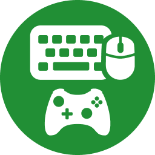

 

## ⚡ Overview

Native Xbox Cloud Gaming (xCloud) on PC strictly requires a connected controller. This extension bypasses that restriction by hooking into the browser's HTML5 Gamepad API and translating raw keyboard and mouse inputs into virtual gamepad events on the fly.

**Why the Community Edition?**
This is a streamlined, telemetry-free fork of the original extension. We ripped out the aggressive paywalls, "trial expired" modals, and server-side dependencies to deliver a pure, performant experience. It's 100% free, lightweight, and gets straight to the point.

## 🛠️ Installation (Manual Sideload)

Since this is an unlocked build, it's not distributed via the Chrome Web Store. You'll need to sideload the unpacked bundle:

1. **Download** this repository as a `.zip` file (Click `Code` -> `Download ZIP`).
2. **Extract** the zip archive to a permanent folder on your machine.
3. Open your Chromium-based browser (Chrome, Edge, Brave) and navigate to `chrome://extensions`.
4. Enable **Developer mode** via the toggle in the top right corner.
5. Click **Load unpacked** (top left) and select the extracted folder.
6. Boom. Ship it. Navigate to `play.xbox.com` and start gaming. 🚀

## 🎮 Usage

Click the extension's puzzle piece icon 🧩 in your browser toolbar to open the config UI. From there, you can toggle the injection script on/off, manage your input profiles, and remap your keybindings directly.

_Disclaimer: This project is an independent community effort and is not affiliated with Microsoft or Xbox._

